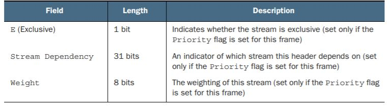

<h1> Navigation </h1>

 - [HTTP 1.* Limitations](#http1limitations)
 - [HTTP/2 Overview ](#http2overview)
 - [HTTP/2 Negotiation](#http2negotiation)
 - [HTTP/2 Frames](#http2frames)
   - [SETTINGS Frame](#settingsframe)
   - [WINDOWS_UPDATE Frame](#windowsupdateframe)
   - [PRIORITY Frame](#priorityframe)
   - [HEADERS Frame](#headersframe)
   - [DATA Frame](#dataframe)
   - [GOAWAY Frame](#goawayframe)
   - [CONTINUATION Frame](#continuationframe)
   - [PING Frame](#pingframe)
   - [PUSH_PROMISE Frame](#pushpromiseframe)
   - [RST_STREAM Frame](#rststreamframe)
   - [ALTSVC Frame](#altsvcframe)
   - [ORIGIN Frame](#originframe)
   - [CACHE_DIGEST Frame](#cachedigestframe)
 - [Client and Server Push](#serverpush)
 - [Optimizing HTTP/2](#http2optimize)
 - [HPACK Header Compression](#hpack)
 - [TCP, QUIC, and HTTP/3](#httpfuture)
 - [Glossary](#glossary)
  

<h1 id="http1limitations"> HTTP 1.* Limitations </h1>

Browser (init request) → DNS → (TCP Handshake = 1.5 round trips) Web-Server → Browser (first resource) → Web-Server (sends back first resource)→ … repeats steps until all resources are downloaded

<h2> Limitations </h2>

- TCL HOL (Head of Line): blocks resource that is ahead of resource being processed: creates a waterfall effect as pictured below:
- Proposed Solutions to the waterfall
- Domain Sharding or Multiple HTTP Connections
- Inefficient due to the TCP 3-Way (SYN_SYN-ACK_ACK) Handshake producing latency (in round trip times), memory (preserving each connection on server), and processing
- Congestion Window’s (CWND) initial slow data transfer is true for all unique HTTP connections opened
- Use fewer but larger HTTP requests
- Spriting is used, but this presents difficult refactoring both for initial set up and future revisions and problems for caching (since a change to one image means the entire image is re-cached/re-downloaded)
- Could require complicated and/or untenable build process for some sites
- Headers are in plain-text (insecure and do not use efficient encoding scheme)

<h2> Reproduce HTTP 1.* </h2>

- To prevent HTTP/2 from running in Chrome do the following for viewing HTTP 1.* limitations:
- --disable-http2 Advanced Settings > Chrome > Command-Line Options 

<h1 id="http2overview"> HTTP/2 Overview </h1>

- Multiplexed connection → multiple streams → interleaved packets (non-blocking)
  - defaults for Apache servers is 100 streams
- Requests can appear to take longer than HTTTP 1.* connections, but this usually only happens when there is bandwidth limitation on the server and/or client
- Load-Balancer (or Reverse Proxy) may only need HTTP\2: the application server may not need it (c.f., page 82 HTTP/2 in Action)
  - Page 83 HTTP/2 for architecture of reverse proxy
  - CDNs seem to be best architecture for HTTP/2
  - Client ← → HTTP/2 CDN ← → Application Server (as a possible example)
- Need ALPN for HTTPS portion of HTTP/2
  - need strong ciphers
- Do NOT forward Upgrade: HTTP/2 header to HTTP 1.* connection
  - ensure headers are valid (more strict than HTTP 1.*)
- Clear cache after upgrading to HTTP/2 (note that proxy or anti-virus may downgrade the connection)
- turn **off** `H2PushDiarySize` on Apache server when testing, so one can debug server pushed resources
- Look out for `Signed HTTP Exchanges` for a server signing off on a resource from a domain it's not authoritative over such as `bootstrap.com`

<h2 id="binaryprotocl"> Binary Protocol </h2> 

- Headers are binary not textual like in HTTP 1.* connections → header compression
- Allows for frames to relate to a unique stream (multiple resources sent at once)
- replaces HTTP 1.1 chunk encoding
- Client initiated requests have odd IDs for stream preventing ID collision 
- servers do not currently initiate requests (but when they do their IDs will be even)
- Stream 0 is control stream for server and client
- Streams are finished/closed upon last bytes of resource sent by server 
- opposed to HTTP 1.* connections allowing for a connection to be kept alive
- debugging HTTP/2 like server push disable cache 

<h1 id="http2negotiation"> HTTP/2 Negotiation </h1>

- ALPN (Application-Layer Protocol Negotiation)
  - replaced NPN (Next Protocol Negotiation)
  - during HTTPS negotiation, server determines what HTTP version(s) the client accepts
  - works as header before reqeusts are sent
  - Do **not** use Upgrade Header for to upgrade to HTTP/2 connection 
    - this upgrade header can get forwarded to a non HTTP/2 server and cause compatibility issues
- client can send an HTTP/2 message that tests if the server understands HTTP/2
    - servers will synchronise by sending a settings frame

<h1 id="http2frames"> HTTP/2 Frames </h1>

General frame format for HTTP/2 frames

<p align="center">
 
</p>

<h2 id="settingsframe"> SETTINGS Frame </h2>

- after ALPN (or some other acceptance method of HTTP/2), a SETTINGS frame is sent by client and server (always the first frame sent is SETTINGS).
  - flag can be set to 0 for advertising settings or 1 for acknowleding (ACK) settings 
- non-specified settings fallback to default values
- stream 0 will be SETTINGS frame or WINDOW_UPDATE frame
  - note that WINDOW_UPDATE can also be applied to one stream and not all streams on the connection (as is the case for stream 0)

<p align="center">
   
</p>

<h2 id="windowsupdateframe"> WINDOWS_UPDATE frame </h2> 

- update max amount of data to send per stream or for all strams on the connection

<p align="center">
   
</p>

<h2 id="priorityframe"> PRIORITY frame </h2>

- fixed-length frame with no flags

<p align="center">
   
</p>

<h2 id="headersframe"> HEADERS frame </h2>

- Everything is either a Header or Pseudo-Header in HEADERS frame
- Pseudo-Headers start with colon and defined in specification
  - this means that one cannot use a custom Pseudo-Header
- Headers are strictly formatted in HTTP/2, so this can cause **bugs** when headers are improperly formatted

<p align="center">
   
</p>

- HEADERS frame flags
  - END_STREAM indicates no more frames to follow (a CONTINUATION frame may still be sent because the frame considered part of the original HEADERS frame)
  - END_HEADERS indicates last of HEADERS frame (no CONTINUATION frame may be sent afterwards)
    - in applied HTTP/2, CONTINUATION frame is rarely used; this is ideal because CONTINUATION frames block other frames from being sent (since all headers must be received by client)
  - PADDED indicates how much padding was used (for security reasons)
  - PRIORITY used for setting the *E* bit to on

<h2 id="dataframe"> DATA frame </h2>

- 2 flags are usable: (1) END_STREAM indicates are data has been sent and (2) PADDED indicates whether padding has been used

<p align="center">
   
</p>

<h2 id="goawayframe"> GOAWAY frame </h2>

- used for communicating that all data has been sent (and connection is no longer needed) **or** an error has occurred
  - last received stream's ID is sent
    - this is usually 0 if GOAWAY frame is sent by client

<p align="center">
   
</p>

<p align="center">
   
</p>

<h2 id="continuationframe"> CONTINUATION frame </h2>

- END_HEADERS is only flag used 

<p align="center">
   
</p>

<h2 id="pingframe"> PING frame </h2>

- ACK is only flag used to indicate PING frame was received
  - destination should send an ACK PING frame back to indicate reception
- sent on stream 0
- measures RTT **or** keep connection alive

<p align="center">
   
</p>

<h2 id="pushpromiseframe"> PUSH_PROMISE frame </h2>

- sends headers as if it were a headers 
- headers are sent because client did not explicityly ask for the resource
- 2 flags: END_HEADERS and PADDED

<p align="center">
   
</p>

<h2 id="rststreamframe"> RST_STREAM frame </h2>

- reset/cancel stream (due to error or resource not needed)
- no flags exist for frame

<p align="center">
   
</p>

<h2 id="altsvcframe"> ALTSVC frame </h2>

- alternate service frame is used for server to advertise different services to download a resource

<p align="center">
   
</p>

<h2 id="originframe"> ORIGIN frame </h2> 

- frame allows server to advertise the domain it will respond to 

<p align="center">
   
</p>

<h2 id="cachedigestframe"> CACHE_DIGEST frame </h2>

- client advertises cached resources
- 2 flages: (1) RESET tells server to refresh client's cache digests and (2) COMPLETE tells server that frame indicates all of client's cache digests 

<p align="center">
   
</p>

<h1 id="serverpush"> Client & Server Push </h1>

- server push is not truly bi-directional lick sockets
- eliminates the need for inlining performance hack
  - this practice should be avoided since it is not a separation of concerns
- HTML, JS, and CSS can all be pushed in slightly less time than 1 RTT
- `rel=preload` predates HTTP/2 but it can now be used for pushing content in HTTP/2
- `as=script||style||font||image||fetch` to indicate type of resource being pushed.  Safer practice to always include this meta-data
- `webpagetest.org` and `nghttp` can show server pushed resources
- resources can be pushed in different ways
  - pushing resource before HTML can be done by the web server (taking control from the app server), or the app server can send HTTP status code 103 (`early hints`) to indicate to push resources while HTML is being processed.  Ensure web server understand status code 103 correctly.
    - `100 Continue`, `101 Switching Protocols`, and `102 Processing` are other informational status codes  

<p align="center">
   
</p>


<p align="center">
   
</p>

<h2> Server to Handle Push </h2>

- the edge server(s) should be in control of pushing content such as receiving `status code 103`.  This is still the case when the app server owns the resource to be pushed (i.e., server has to request the resource to be pushed). </br> </br>

<h2> Server Push on Client Browser </h2>

- be aware that browser's can handle pushed resources differently.  One implementation is to put pushed resources in a special HTTP/2 cache.  The browser looks in this cache before requesting the resource from the server

  - if cached headers are set, the resource is also stored in the normal cache
  - ensure SSL certificates are trusted to ensure resources are properly cached
  - order of caches checked depends on browser implementation
    - it is possible for a pushed resource to not be used because of a higher precedent cache contains a match; the browser will go by first match and not check for statleness/date
  
<p align="center">
   
</p>

<h3> Client Cache </h3>

- *image cache* is in-memory cache preventing image from being fetched more than once per page (destroyed upon navigating away from page)
- *preload cache* is in-memory cache for pre-loaded resources.  This is per page cache and cannot be reused for different pages
- *service workers* implement some native-like functionality and can function without network connectivity.  They have their own cache
- *HTTP Cache* is disk-based persistent cache shared accross the browser
- *HTTP/2 push cache* is in-memory cache bound to the connection (destroyed upon GOAWAY frame).  Some browsers may start a different connection per tab, and this diminishes some of the benefit of pushing resources

<h3> RST_STREAM frame for Client </h3>

- Client may tell the server to end stream with a CANCEL or REFUSED_STREAM code.  Potential reasons are that browser already has the resource or the page has been navigated away from (and resource is no longer needed).  
- RST_STREAM can be received too late by the server, and the server has already pushed the resource.
   - ensure only necessary resources are pushed
   - if a resource is never used on the page, the pushed resource may not show up on the network tab in dev tools.  Thoroughly check pushed resources

<h2> Conditional Server Pushing </h2>

- server could keep track of connection and not push resource if that resource has been pushed on that connection before.  (This method cannot handle the client cache getting cleared which would be unknwon to server.)
 - client sends `if-modified-since` or `etag` HTTP header to indicate page cache has been expired.  The server can make an *educated guess* that the other (previously pushed) resources are expired as well.
- cookies could be set to indicate a resrouce has been pushed.  This is better than previous 2 methods, but it could be independently reset or turned off browser side.
- CACHE_DIGEST frame is not supported client-side (with some servers like Apache support it).  The frame allows the client to notify the server of all the cached content for every domain that the serving domain is authoritative over
     - uses `cuckoo filter-based digest` with low-probability of clashing to compress message size in communicating cached content
     - would need to use server-workers to mimic functionality
     - standardization has been paused

  <h2> Resources to Push </h2>

- Clients may disable server push with SETTINGS_ENABLE_PUSH to 0 in SETTINGS frame
- requests must use cacheable and safe method (GET, HEAD, and some POSTS)
- cannot contain request body 
- pushed resources only to domains that the server is authoritative over
- only servers can push
- resource can only be pushed in response to an active request

<h3> In practice</h3>

- resources are only pushed over GET requests
- error on *underpushing* content because push content should be long enough to fill up what would have been network idle time
  
<h2> Troubleshooting Server Push </h2>

- Ensure HTTP/2 protocol is used some clients and servers may not support it.  
- Tools like *nghttp* can examine if there are any PUSH_PROMISE frames coming through
- if resource-to-push does not exist, frame will result in a 404 that's logged
- ensure certificate is trusted

<h2> Alternate to Server Push </h2>

- use `preload` to indicate to browser that a resource is critical to page load
```html
//header
Link: "</assets/css/styles.css>;rel=preload;as=style;nopush" 
//HTML
<link rel="preload" href="/assets/css/styles.css" as="style">
//prefetch DNS lookup to save time in finding route to needed server
//it is only a DNS lookup designed to save one RTT, but this RTT is blocking of potentially several resources
<link rel="prefetch" href="/assets/css/styles.css">
//rel="preconnect" will handle all initial TCP setup, but it can disconnect if done too far in advance
//rel="prefetch" will fetch a resource (after all current page resources are loaded) and store in HTTP Cache for future use
//rel="prerender" will entirely prerender a page, so that it instantly loads on click/navigation.  Support may be limited, and it is the mostly costly option in terms of bandwidth and time
```
- pros are that the browser is *cache-aware* and can prevent unnecessary requests accurately and can request cross-domain
  - Chrome dev tools show all pre loaded content regardless of them being used
- must check `status code 103` and `Link HTTP Headers` support on browser side for `preloading content`
- below is the request/response flow example of browser received `status code 103`  

<p align="center">
   
</p>

<h1 id="http2optimize"> Optimizing for HTTP/2 </h1>

Typical flow for making a request inside browser. </br>

<p align="center">
   
</p>

<h2> Considerations for HTTP/2 Implementation </h2>

-  Servers usually limit SETTINGS_MAX_CONCURRENT_STREAMS to 100 or more.  Meaning that several resources could get bottlenecked depending on the amount of resources needed for a webpage.
- A larger file (such as 1 100kB file) gets a larger compression ratio than a smaller file (such as 1 10kb file) because more duplicates within a larger file can be found
  - concatenating text resources can still be a good idea to gain benefits of compression
- because HTTP/2 opens up a large amount of concurrent requests/streams, critical resources can be bottlenecked.  For example, high quality images may take up the bandwidth for resources needed for page interactivity. 
- if implementing server push is not deemed to be desirable, inlining code might still be a good solution for maxmizing performance.  However, the middleground approach of preloading may be the best of the both worlds currently. 
- using a CDN: as this reduces *last-mile latency*. 

<h2> Reducing Payload Sizes </h2>

- www.tinyjpg.com or www.tinypng.com will compress images
- GZIP is common compression encoder, but Brotli is gaining popularity.
- minification has the benefit of completely getting rid of internal comments to those who would reverse minified source code.  Downside is that bugs are harder to debug in production: `source maps` help, but they require configuration and not the same as non-minified code.  Compression gives the most benefit while minification is a small enhancement. 
- caching is not fundamentally changed by HTTP/2; the `cache-control` headers are still the same.  Because HTTP/2 uses one connection, using `status code 304` to indicate to the client that the cache is **not** stale can be a good practice.  HTTP 1.* has big costs for each new connection, and the time difference between a 200 and 300 series response is generally negligible.  TCP overhead is handled at the initial start of an HTTP/2 connection, so using the server to validate cache is not stale is a better method than it was in HTTP 1.*.
  - investigate `Service Workers` ability to assist in HTTP/2 caching

<p align="center">
   
</p>

Good reference for explaing Service Worker's role
<p align="center">
   
</p>

<h2> Optimizing HTTPS for Initial Connection Setup </h2>

- server all resources under HTTPS
  - content security policy `upgrade-insecure-requests` can help with this
- ensure HTTPS certificat is valid
- ensure quarterly (at least) checks on HTTPS configuration
  - for example, latest TLS stable version is enabled
  - `SSLLabs Server Test` aides in assessing complience with current standards
- consider TLS `session resumption` for quicker subsequent connections (some security concerns)
- remember that stronger security can be slower performance (balance is key)
- these concerns can mostly be outsourced to a CDN

<h2> HTTP/2 Usage by Clients </h2>

- for Apache,`httpd.conf` file has option to log HTTP protocol 
- for Nginx, `$server_prtoocl` env variable can be logged for HTTP protocol
- note that the edge server(s) - such as a load balancer - should be measured for HTTP/2 usage
- to count by HTTP protocol use the following command:

```bash
$ grep -oh 'HTTP\/[0-9]\.[0-9]*' ssl_access_log | sort | uniq -c
```
- best to detect HTTP protocol server-side because client may be using some form of proxy that obscures HTTP/2 support

<h2> HTTP/2 Connection Coalescing </h2>

- HTTP/2 connection can be reused for multiple domains if they are **authoritative*. 
  - authoritative means that the domains resolve to the same IP address *and* HTTPS certificate covers both of them
- use the `:authority` pseudo-header for coalescing
  - verify support of pseduo-header before usage
- a `status code 421` can inform the wrong server was requested for incorrect coalescing **or** `ORIGIN frame` can be used to inform client what the server is authoritative over

<h2> Advanced HTTP/2 Topics </h32>

<h3> Streams </h3>
Streams are less expensive than HTTP 1.* connections because a stream is more of a concept than a separate entity.  That is, a stream is just data exhange with a (stream) id for organization.  This has the tradeoff with HTTP/2 connections being more expensive because ALPN and HTTPS. 
<h4> Client Intiated Streams </h4>

- *Idle* state occurs when stream is initially created or referenced
- *Open* state is ended only when all HEADERS have been sent by client
- *Half-closed* state is immediately after END_STREAM flag (indicating client has sent all headers).  Client should not send any more data regarding this stream unless it's a WINDOW_UPDATE frame
- *Closed* state is when server has sent all data with an END_STREAM flag set

<h4> Server Intiated Streams </h4>

Currently, the only server intiated streams are server pushed resources.

- *Idle* state is when a stream is first referenced by a PUSH_PROMISE frame
- *Reserved* state is time when headers for the resource are being sent to client (since client never sends data for this resource *Open* state never occurs)
- *Half-closed* state is when server is pushing the resource
- *Closed* state is when server has pushed all data with END_STREAM flag set

<h4> Stream Flow-Chart </h4>
- PRIORITY, SETTINGS, PING, and WINDOW_UPDATE frames do not alter state of a given stream
- CONTINUATION frame is an extension of HEADERS frame, so it also does not alter state of a given stream
- errors should result in PROTOCOL_ERROR messages, and these pertain to low-level client/ server implementaiton details
<p align="center">
   
</p>

<h3> Flow Control </h3>

- Flow control is necessary at the application layer as well as the TCP layer.  Application layer flow control is disucssed here
- SETTINGS_INTIAL_WINDOW_SIZE can be left to default value or set custom size
- WINDOWS_UPDATE frame can increase this amount for larger data flow
- if an HTTP/2 connection sends a small amount of data; it is possible that a WINDOWS_UPDATE frame will not be sent

<h3> Stream Priority </h3>

- stream priorities can "suggested" by the client, but per specification the server can ignore the priority of a resource. 
- Priority may be set in HEADERS frame or PRIORITY frame (to reprioritize the resource)
- priority is a either set by dependcy or weight

<h4> Stream Dependency </h4

- by default, every resource is depenent on stream 0
- resources can be made be depedent on other resource as shown below
  - note that a resource cannot be dependent on multiple resources (currently)
- setting exclusive to 1 (opposed to default 0) will make a resource with the same dependency as other resource(s) have higher priority

<p align="center">
   
</p>

<h4> Stream Weighting </h4>

- Weighting can determine amount of resources dedicated to serving a resource.  Weight 100 ought to get 10 times the resources as a different resource that's weight 10.
- dummy streams (that never send requests) can act as a way put equal weight to several resources: as pictured below
  - all requests are made dependent on one of the dummy streams
- default weighting is 16

<p align="center">
   
</p>


<h3> HTTP/2 Compliance with Specification </h3>

`h2spec` utility tests HTTP/2 implementation in strictness of adhering to specificaiton such as certificates.

<h1 id="hpack"> HPACK Header Compression </h1>

<h2> Header Compression </h2>

- Lossy Compression: compression that balances quality and size reduction (not suitable for headers because all data needs to be maintained)
- Lossless Compression: removes reptitive information and adds it back later (good for headers)
  - Lookup Tables: tables that have key-value pairs for substituting repeated data with smaller data.  Lookup table could be static (predetermined/standardized) or dynamic (sent with compressed data)
  - Efficient Encoding Schemes: an example is using small amount of bits to encode a picture when only a few colors are being used.  Encoding schemes that a smaller amount of data can be better (e.g., UTF-8 vs UTF-16)
  - Lookback Compression: encoding scheme tells decoder how many characters to go back to find a repeat.  Decoder goes back to the repeat and inserts it at the previously unknown value

<h2> Body Compression </h2>

- body compression is usually reserved for text as images  often come precompressed formats (such as JPEG)
- `accept-encoding: gzip, deflate, br` tells the server that the client accepts the list encoding algorithms
- `content-encoding: gzip` tells the client what decoding algorithm to use (gzip in this case)
- `HttpOnly` should be set for headers that should be hidden from JS like an authorization token
- `deflate-based` compresssion is vulnerable since contents can be guessed by length especially when differents contents can be sent and analyzed; `gzip` of SPDY was exposed for header compression by `Compression Ratio Info-leak Made Easy` (CRIME)

<h2> HPACK </h2>

- Based on lookup-tables and Huffman econding
- Designed to be inflexible and non extensible
- static lookup table is used by both requests and responses for common information such as `GET method`; the index of the key such as `method` can be used for a less common value like `DELETE`
- lookup table for char values (such as 'A') j is defined in specification

<h3> Dynamic Lookup Table </h3>

- dynamic lookup table starts at position 63 (where the static table leaves off), and it's size is defined by SETTINGS_HEADER_TABLE_SIZE.  This table exists per HTTP/2 connection
- one table is maintained by server and client (whereas static is specification defined)
- `literal header field representation` (starts with 1) is when key-value pair is already defined resulting in an index reference to said pair (minimum 7 bits of padding)
<p align="center">
   
</p>

  - `literal header field with incremental indexing` (starts with 01) used when the key (header name) is known or entire key-value pair is unknown.  H bit is set for Huffman encoding, and 0 on H bit is used for ASCII encoding (shortest encoding scheme should be used).  First picture below is when header index is known; second picture is when no information is indexed yet
    - the  H bit can be sit on a per header basis
<p align="center">
   
</p>
<p align="center">
   
</p>

  - `literal header field without indexing` (starts with 0000) is when the value is not going to be indexed because the value is likely to change (e.g., path value); the header value may be inexted.  First picture below shows when header is indexed; second picture shows no indexing
    - note that browsers may implement compression differently as far as indexing
<p align="center">
   
</p>
 
 - `literal header field never indexed` (starts with 0001) is information that is to never be indexed should be sensitive information like passwords.  First picture below shows when header is indexed; second picture shows no indexing.
  - note that cookies (even sensitive ones) are handled differently in browsers 
<p align="center">
   
</p>

<h2> Final Notes on HPACK </h2>

- Cloudflare saw 53% reduction in data sent where HPACK was enabled
- Check server implementation becuase HPACK may not be supported by default

<h1 id="httpfuture"> TCP, QUIC, and HTTP/3 </h1>

What slows down TCP?
- There’s a setup delay. Sequence numbers that are to be used by sender and
receiver must be agreed on at the start of the connection.
- The TCP slow start algorithm restricts the performance of TCP, as it’s cautious about how much data it sends to avoid retransmissions as much as possible.
- Underuse of the connection causes TCP to throttle back. TCP scales the CWND
back down if the connection isn’t fully used, as it can’t be sure that the network
parameters haven’t changed since the last optimal CWND was established.
- Lost packets cause TCP to throttle back. TCP assumes that all packet loss is due
to congestion, which may not always be the case.
- Packets may be queued. Packets received out of order may be held back to
ensure that order is guaranteed.

<h2> Slow Start TCP Algorithm </h2>

- congestion window starts at 10 segments with 1460 bytes Maximum Segment Size (MSS)
- the window will usually double for every RTT up to five times. 
  - then it goes into `congestion avoidance` increasing the window very slowly
- idleness on the page lowers the congestion window
  - reading an article could degrade performance by the congestion window significantly lowering
  - this effect is mitigated in HTTP/2 as there is likely only one connection that's kept warm by XHR and other activity
- packet loss can halve (or less) the congestion window, and it then goes into `congestion avoidance` (slow growth)
  - this can be devastating to HTTP/2 with only one connection
  - the packet loss may not be because of buffer overflow, and the mitigation may have been unnecessary
  - packet loss can also block other resources.  If HTML resources losses a packet and the CSS finishes, the browser still has to wait for the HTML to finish downloading because TCP gauruntees delivery order.
      - packet loss of 2% is very bad for HTTP/2 since it has one connection (usually), and HTTP 1.* outperforms in this case
      - HTTP/2 can be bottlenecked by TCP HOL (head of line) blocking, so HTTP/2 only git rid of HTTP HOL
<h2> TCP Settings </h2>

- note that TCP implementation is determined by low-level implementation details of the OS
- Congestion window size (for initial) is usually hardcoded into kernel and not changeable
- `Window Scaling` is max congestion window.  Default is 65,535 bytes, but some OSs have it go to 1GB
- `Selective Acknolwedgment` (SACK) allows for out of order packets to be acknowledge: e.g., packet 4 can be acknowledged when packet 3 was lost.
- `Slow Start Restart` disabling it would prevent idleness from adversly affecting future requests on the connection
- `TCP Fast Open` only works on TCP reconnections on the SYN message by the client.  Fast open allows the client to send a message with the SYN.  Latency can be drastically reduced with this enabled (and supported by server and client).
- CUBIC algorithm was replaced by Proportioanl Rate Reduction (PRR) for less severe reduction in congestion window.  Bottleneck, bandwidth, and round-trip propogation time (BRR) is the newest algorithm and is developed by Google: designed to improve HTTP/2 connections.  Some say it may eat up a lot of resources disproportionately.  Algorithm used for TCP affects its behavior especially for a webserver

<h2> QUIC an alternative to TCP </h2>

- QUIC (pronounced quick) is a UDP-based protocol developed by Google.  Originally stood for Quick UDP Internet Connections; now the specification states that it's just a name
- Forward Error Connection (FEC) is experimental.  Would be able to reconstruct a lost packet based on delivered packets
- Able to use multipe types of mediums (even at the same time with multipath increased bandwidth) on the connection such as mobile and wi-fi.  TCP cannot do this because it establishes a new connection for an IP address change
- connection and encryption is handled in one round trip
- ports and packet checksum (for integrity) still exist, but reliability, ordering, and congestion control must be handled at a higher layer
- QUIC is being pushed because of *ossification* where baked-in assumptions about TCP make innovation difficult and slow
- QUIC is a faster solution because creating a brand new protocol on top of IP requires implementation at the OS level (since applications generally do not access packets).  QUIC uses UDP, and it can therefore be quickly implemented
- QUIC is implemented on top of UDP (at the application layer), so implementation is quick.  Some downsides to this:
  - UDP can be blocked by firewalls
  - more importantly, TCP lives in the kernel and is much faster for servers to process than UDP that lives in the user space
- HTTP/3 will be HTTP over QUICK
- QPACK will replace HPACK and remove TCP HOL for header compression as the dynamic lookup table does for HPACK 

<h2> HTTP Versions in OSI Model </h2>

<p align="center">
   
</p>

 <h2> DNS over HTTPS (DoH) </h2>

 Google and Cloudfare have implemented DoH on server-side </br>
 See [Firefox's explanation](https://hacks.mozilla.org/2018/05/a-cartoon-intro-to-dns-over-https/) for more detail

 <h1 id="glossary"> Glossary </h1>

- virtual hosting: multiple websites hosted on same server
required HTTP to have explicit base URL in headers
- headers: processing instructions for each request are in plain-text (non-binary format) for HTTP 1.*, and this presents a security and performance issue as items like cookies are not sent in the most compact format
- TLS (Transport Layer Security): replace SSL (Secure Socket Layer) as de facto HTTP security standard as SSL vulnerabilities become untenable
- some sources refer to to TLS as TLS, SSL, and/or SSL/TLS (SSL is deprecated)
- Encryption = message (request/response cycle) is private (makes it non-readable to humans and machines without cipher such as private key in public key encryption) 
- Integrity = message (request/response cycle) is unaltered (thus checksum verification)
- Authentication = server is the intended device/company to communicate with (thus CA/Certificate-Authorities)
- Domain Sharding: allows up to 6 different connections in browser even when server is the same because domains served are different
- Congestion Window (CWND): uses slowstart algorithm that ensures the requesting network is not overloaded by the server’s response(s)
- Spriting: combining small images into one large image and use JS/CSS to select relevant portion/section of large image (e.g., social media icons)